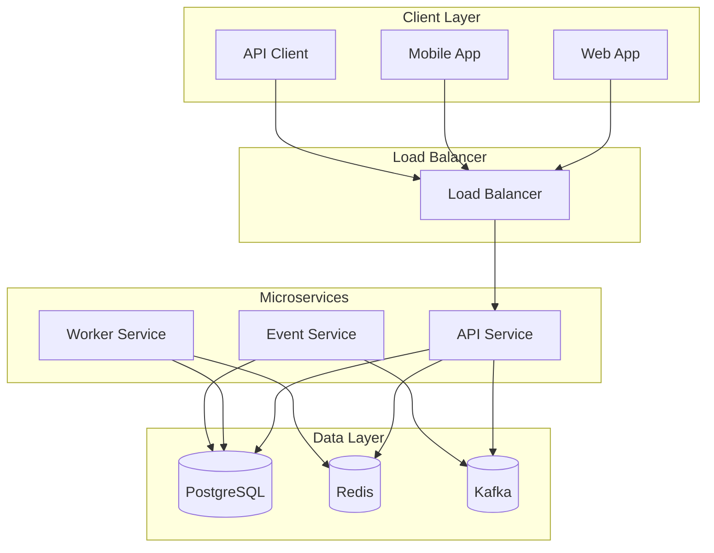

# Rust Microservices Documentation

This directory contains comprehensive documentation for the Rust Microservices project.

## 📚 Documentation Index

### Architecture & Design
- [Architecture Overview](architecture.md) - High-level system architecture and design decisions
- [API Documentation](api.md) - REST API endpoints and usage examples
- [Database Schema](database.md) - Database design and entity relationships
- [Event Streaming](events.md) - Kafka event patterns and message schemas

### Deployment & Operations
- [Deployment Guide](deployment.md) - How to deploy services to different environments
- [Configuration](configuration.md) - Environment variables and configuration options
- [Monitoring](monitoring.md) - Observability, metrics, and alerting setup
- [Troubleshooting](troubleshooting.md) - Common issues and solutions

### Development
- [Development Setup](development.md) - Local development environment setup
- [Contributing](contributing.md) - Guidelines for contributing to the project
- [Testing](testing.md) - Testing strategies and best practices
- [Security](security.md) - Security considerations and best practices

## 🚀 Quick Start

1. **Setup Development Environment**
   ```bash
   ./scripts/setup.sh
   ```

2. **Start Services**
   ```bash
   just up
   ```

3. **Run Tests**
   ```bash
   just test
   ```

4. **View API Documentation**
   - Health Check: http://localhost:8080/health
   - Metrics: http://localhost:9090/metrics
   - Grafana: http://localhost:3000 (admin/admin)

## 🏗️ Architecture Overview



## 📊 Service Overview

| Service | Purpose | Port | Health Check |
|---------|---------|------|--------------|
| API Service | REST API endpoints | 8080 | `/health` |
| Worker Service | Background job processing | - | Internal |
| Event Service | Kafka event streaming | - | Internal |
| PostgreSQL | Primary database | 5432 | - |
| Redis | Cache and sessions | 6379 | - |
| Kafka | Event streaming | 9092 | - |

## 🔧 Development Tools

- **justfile** - Task runner with common commands
- **Docker Compose** - Local development environment
- **Cargo** - Rust package manager and build tool
- **SQLx** - Database migrations and queries
- **Prometheus** - Metrics collection
- **Grafana** - Metrics visualization
- **Jaeger** - Distributed tracing

## 📈 Monitoring & Observability

- **Metrics**: Prometheus + Grafana
- **Tracing**: Jaeger
- **Logging**: Structured JSON logs
- **Health Checks**: Built-in health endpoints
- **Alerting**: Prometheus AlertManager (configurable)

## 🔒 Security Features

- JWT-based authentication
- Password hashing with Argon2
- Rate limiting
- CORS configuration
- Input validation
- SQL injection prevention
- Audit logging

## 🚀 Deployment Options

- **Docker Compose** - Local development and testing
- **Kubernetes** - Production deployment with scaling
- **CI/CD** - GitHub Actions workflows
- **Infrastructure as Code** - Kubernetes manifests

## 📞 Support

For questions, issues, or contributions:

1. Check the [Troubleshooting Guide](troubleshooting.md)
2. Review existing [GitHub Issues](https://github.com/yourusername/rust-microservices/issues)
3. Create a new issue with detailed information
4. Follow the [Contributing Guidelines](contributing.md)

## 📄 License

This project is licensed under the MIT License - see the [LICENSE](../LICENSE) file for details.